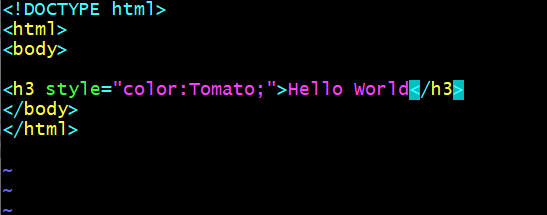
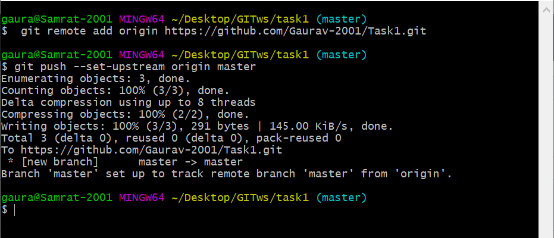
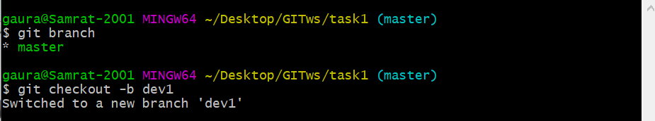

# GitHub - Jenkins - Docker Integration

### Aim:
* Now a days industries are moving towards automation so integrating tools like git GitHub Jenkins and docker is quite essential
* The project is meant to integrate git GitHub jerkins and docker to solve some real life use cases

### Use-Case :
* If Developer push to dev1 branch then Jenkins will fetch from dev1 and deploy on DevEnv environment.
* Manually the QA team will check (test) for the website running in DevEnv docker environment. If it is running fine then Jenkins will merge the dev1 branch to master branch and trigger
* If Developer push to master branch then Jenkins will fetch from master and deploy on ProdEnv environment.

### Requirement :
* Git Bash
* Jenkins
* Docker-CE

## Step-by-Step Procedure:

1. At the most create an git repository in git hub

2. Create an git local repository using git bash

3. cat >> code1.html #write the code to be entered

4. Add the code to staging are and further commit it

5. Next push the code to the GitHub repository

6. For our use case we need one more branch so create an new branch dev1

7. Append the same code and commit the code from dev1 branch and Next push it to GitHub

8. We Now need to create an set up so as when the developer commit the code it automatically push to GitHub for this purpose create an post-commit File in .git/hooks folder and add the following code in it.

9. Before going to Jenkins we need to create the webhooks so that Jenkins could be triggered properly whenever it is needed. here for creating the URL (public URL) I used Ngrok

10. Job1(git_dev): creates and deploys the developer code in developers environment

11. Job2(Testing(QAT)) : Runs only when Job1 is done and merges the dev1 branch with master when all code is good

12. Job3(git_prod): creates and deploys the developer's tested code in production environment

13. For more testing append and push the code1.html again and test the project

***Here we successfully complete our task1!!!!***
> ***An very special thanks to Mr. Vimal Daga sir for grooming us is all these fantastic technologies and tools and making us realize their use cases in today's world. I also thanks to all the volunteers who helped me whenever I faced any issues. Thank-you Vimal sir and Linux world***
